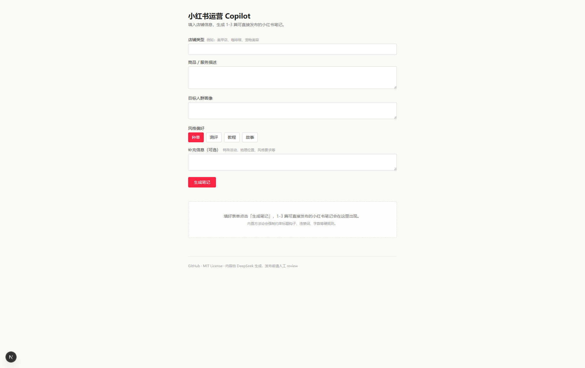

# 小红书运营 Copilot

> 给单人店铺老板用的小红书内容生成 + 账号诊断工具。输入店铺信息与商品场景，自动产出 1-3 篇可直接发布的笔记。

内置一套通用的小红书运营方法论作为系统约束，模型在硬规则下创作，自动规避违禁词、套路化、流量低效问题。可自由替换为你的私房方法论。


[](LICENSE)


---

## 功能

| 版本 | 能力 | 状态 |
|---|---|---|
| **v1.0** | 创作流：表单输入 → 1-3 篇小红书笔记（标题 + 正文 + 标签 + 封面文案）+ 选题思路解释 | ✅ 当前 |
| v1.1 | 方法论从 prompt 搬到向量库，支持后台维护条目 | 规划中 |
| v1.2 | 生成结果自动评分 + 不及格自动改写（Reflection 循环） | 规划中 |
| v1.3 | 账号诊断流：粘贴笔记 → 出诊断报告 + 改进建议 | 规划中 |
| v1.4 | 多账号 Memory：每个店铺独立画像与历史 | 规划中 |

---

## 截图

> 启动后访问 `http://localhost:3000`。表单 → 流式进度 → 笔记卡片。




---

## 技术栈

- **前端**：Next.js 15 (App Router) + React 18 + Tailwind v3 + TypeScript — 推荐部署 Vercel
- **后端**：FastAPI + LangGraph (Python 3.12) — 推荐部署 Railway / Fly / 任何容器平台
- **数据**：Supabase (Postgres) — **可选**，没配置就跳过持久化
- **模型**：DeepSeek V3 (`deepseek-chat`) 主力；依赖 DeepSeek Context Caching 自动命中长 prefix（方法论），无需手动 `cache_control`
- **流式**：FastAPI `StreamingResponse` + LangGraph `astream_events(version="v2")` + 浏览器手解 SSE

---

## 项目结构

```
xhs-copilot/
├── apps/
│   ├── api/                  # FastAPI + LangGraph 后端
│   └── web/                  # Next.js 前端
├── docs/                     # 架构 / 路线图
├── .github/                  # CI 工作流 / Issue 模板 / PR 模板
├── CONTRIBUTING.md
├── CODE_OF_CONDUCT.md
├── LICENSE
└── README.md
```

子项目各自的 README 包含完整本地开发、API、部署、环境变量说明：

- [apps/api/README.md](apps/api/README.md)
- [apps/web/README.md](apps/web/README.md)

---

## 快速开始

需要：Python 3.12+、Node 20+、[DeepSeek API Key](https://platform.deepseek.com)。Supabase 可选。

```bash
git clone https://github.com/zYellow0826/xhs-copilot.git
cd xhs-copilot

# 1. 启动后端
cd apps/api
python -m venv .venv && source .venv/bin/activate   # Windows: .venv\Scripts\activate
pip install -r requirements.txt
cp .env.example .env                                # 至少填 DEEPSEEK_API_KEY
uvicorn main:app --reload --port 8000

# 2. 启动前端（另开终端）
cd apps/web
npm install
cp .env.local.example .env.local                    # 填 API_BASE_URL=http://localhost:8000
npm run dev                                         # http://localhost:3000
```

健康检查：

```bash
curl http://localhost:8000/health
# {"ok":true,"version":"1.0.0","supabase":false}
```

---

## 配置一览

### 后端（apps/api/.env）

| 变量 | 必填 | 说明 |
|---|---|---|
| `DEEPSEEK_API_KEY` | ✓ | DeepSeek 平台申请 |
| `DEEPSEEK_BASE_URL` | | 默认 `https://api.deepseek.com/v1` |
| `DEEPSEEK_MODEL_CHAT` | | 默认 `deepseek-chat`（V3） |
| `DEEPSEEK_MAX_TOKENS` | | 默认 `4096` |
| `DEEPSEEK_TIMEOUT_SECONDS` | | 默认 `60` |
| `DEEPSEEK_RETRY_MAX` | | 校验失败重试次数，默认 `2` |
| `SUPABASE_URL` | | 可选；不填就跳过持久化 |
| `SUPABASE_SERVICE_KEY` | | 同上 |
| `CORS_ALLOW_ORIGINS` | | 默认 `*`，生产建议填具体域名（逗号分隔） |

### 前端（apps/web/.env.local）

| 变量 | 必填 | 说明 |
|---|---|---|
| `API_BASE_URL` | ✓ | 后端地址，本地 `http://localhost:8000` |
| `NEXT_PUBLIC_SUPABASE_URL` | | v1.4 多账号 Auth 用，当前可不填 |
| `NEXT_PUBLIC_SUPABASE_ANON_KEY` | | 同上 |

---

## 自定义方法论

[apps/api/prompts/methodology.md](apps/api/prompts/methodology.md) 是 prompt 质量的核心。本仓库内置了一份**通用版**，覆盖选题、标题、正文、标签、封面、违禁词、对标爆款套路，约 300 行。

替换为你自己的方法论：

1. 直接编辑 `methodology.md`，保留三段式结构（硬规则 / 套路 / 反面案例）即可
2. 越长越稳定的 prefix，DeepSeek Context Caching 命中率越高
3. 改完不用重启（uvicorn `--reload` 会自动重载）

---

## 关键设计决策

| 决策 | 选择 | 理由 |
|---|---|---|
| 前后端分离 | Next.js + FastAPI | LangGraph 的 Python 生态最成熟；前端纯展示层易部署 Vercel |
| 编排 | LangGraph `StateGraph` + `TypedDict` | 节点输入输出可追踪，调试友好 |
| 结构化输出 | DeepSeek function calling + `tool_choice` 强制锁定 | 比 JSON mode 更可控 |
| Streaming | `astream_events(v2)` + SSE | 前端能展示"当前 agent 在做什么"，体验更好 |
| 方法论加载 | v1.0 硬编码进 prompt + DeepSeek 自动 Context Caching | 简单、缓存命中率高；v1.1 起搬到 pgvector |
| Supabase | 可选依赖 | 降低首次试用门槛；要持久化时再开 |

更多请见 [docs/ARCHITECTURE.md](docs/ARCHITECTURE.md)。

---

## 部署

- **后端**（Railway）：Root Directory = `apps/api`，仓库内置 `Dockerfile` 自动识别
- **前端**（Vercel）：Root Directory = `apps/web`，环境变量填后端域名

详见 [apps/api/README.md#部署railway](apps/api/README.md) 和 [apps/web/README.md#部署vercel](apps/web/README.md)。

---

## 路线图

见 [docs/ROADMAP.md](docs/ROADMAP.md)。

---

## 贡献

欢迎 Issue / PR。动手前请先看 [CONTRIBUTING.md](CONTRIBUTING.md)，大改建议先开 Issue 对齐方向。参与项目请遵守 [CODE_OF_CONDUCT.md](CODE_OF_CONDUCT.md)。

---

## License

[MIT](LICENSE) © 2026 ZhangSH

生成的内容仅供参考，发布前请人工 review；本项目不对生成内容的合规性、效果负责。
